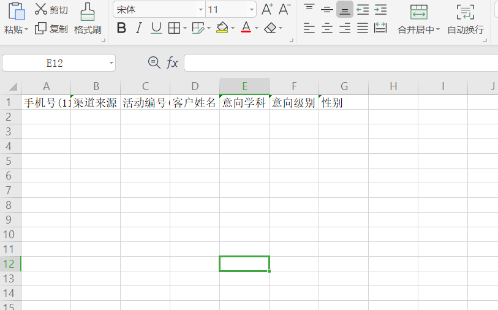
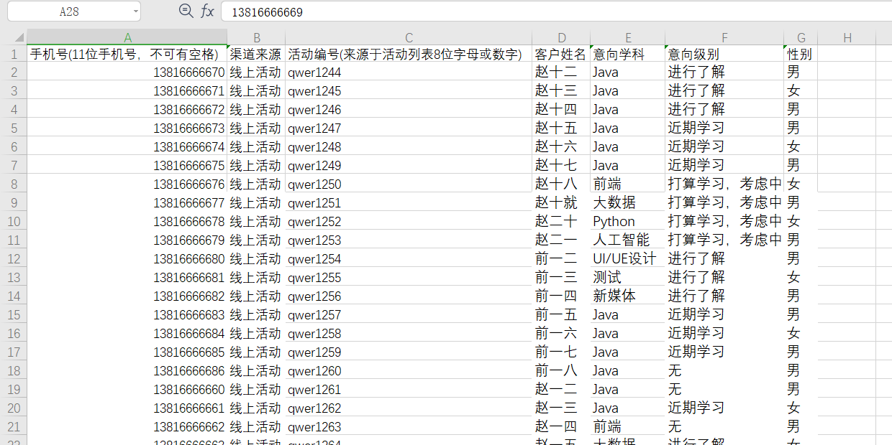
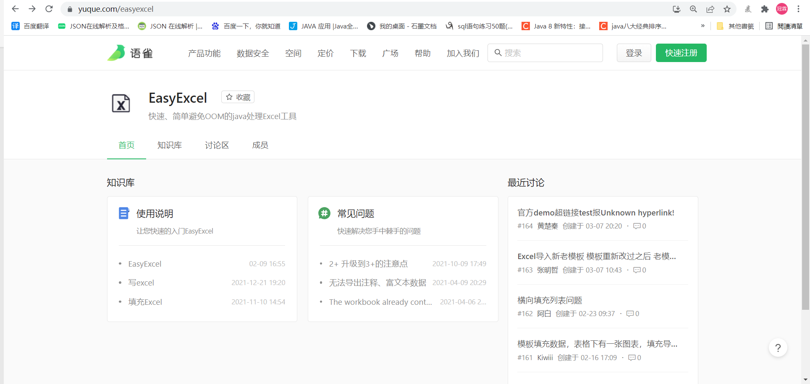
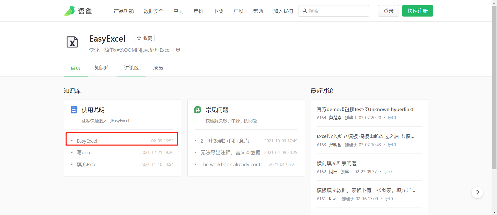
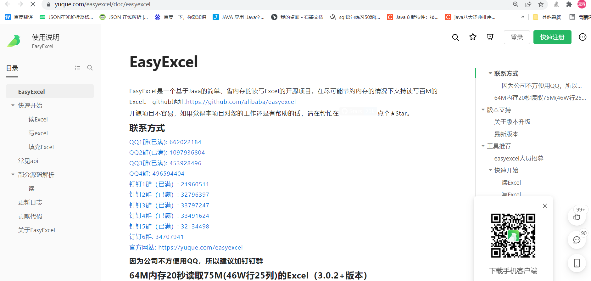
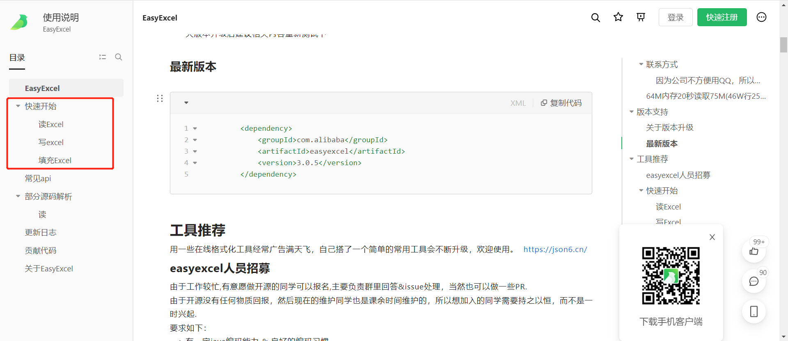

# 20-1-EasyExcel技术调研（实现）

## 1.如何调研

​	参考官网上的内容

​	官网地址如下：

​	https://yuque.com/easyexcel

​	git地址：

​	https://gitcode.net/mirrors/alibaba/easyexcel?utm_source=csdn_github_accelerator

## 2.如何学习技术

​	搞清楚是什么,有什么用？

​	怎么用？

​	对比同类技术的优势劣势


带着问题来调研：

​	需求：

​	为什么要调研EasyExcel，因为我们要做一个线索的批量导入功能，

​	因为线下做活动或线上做推广的时候（比如你留一个手机号给给你一瓶水），活动的运营人员会收取很多的手机号，个人信息，这些手机号不可能让活动人员到我们的crm系统中一个一个进行录入,他最多整理成一份excel，然后在crm端应该有一个功能，这个功需要能批量的导入excel中的线索到我们的数据库中

线索模板如下图所示：



线索数据如下图所示：



​	在学员任务资料-任务22-技术应用-线索模板-clues.xlsx		(线索数据的模板)

​								-线索数据-2100clues.xlsx	(线索模板)

那么多的数据，需要利用技术解析出每一列的数据，整理好数据后存储到数据库中

## 调研EasyExcel

​	范围官网：https://www.yuque.com/easyexcel	

​	我们先了解什么是EasyExcel



通过阅读官方官方文档来了解这个技术是什么

# EasyExcel

EasyExcel是一个基于Java的简单、省内存的读写Excel的开源项目。在尽可能节约内存的情况下支持读写百M的Excel。 github地址:[https://github.com/alibaba/easyexcel](https://github.com/alibaba/easyexcel)

## 版本支持

- 2+ 版本支持 Java7和Java6
- 3+ 版本至少 Java8


## 如何使用EasyExcel，EasyExcel能做什么

通过官网我们可以看到EasyExcel,主要是对Excel进行读写填充这样的操作



对应的导入的jar包同样也有提供

```xml
        <dependency>
            <groupId>com.alibaba</groupId>
            <artifactId>easyexcel</artifactId>
            <version>3.0.5</version>
        </dependency>
```

读Excel

具体代码参考官网上的demo

https://www.yuque.com/easyexcel/doc/read

​	总结：

​		1）根据excel里的内容，创建对应的实体类

​		2）创建对应的监听类，并且实现ReadListener接口并且需要在监听器内，invoke方法和

​		doAfterAllAnalysed方法，其中invoke方法当EasyExcel解析了一条数据后就会执行，			 

​		doAfterAllAnalysed方法，在所有数据都解析完成后会执行

​	官网提供了多种方式与Excel中的列对应上

```java
    /**
     * 强制读取第三个 这里不建议 index 和 name 同时用，要么一个对象只用index，要么一个对象只用name去匹配
     */
    @ExcelProperty(index = 2)

	/**
     * 用名字去匹配，这里需要注意，如果名字重复，会导致只有一个字段读取到数据
     */
    @ExcelProperty("字符串标题")
```

​	编写监听器继承AnalysisEventListener

```java

public class ExcelListener extends AnalysisEventListener<TbClueExcelVo> {
  /**
	 * 每解析一行数据都要执行一次
	 * @param data
	 * @param context
	 */
	@Override
	public void invoke(TbClueExcelVo data, AnalysisContext context) {
    	xxx
	}

	/**
	 * 当所有数据都解析完成后会执行
	 * @param context
	 */
	@Override
	public void doAfterAllAnalysed(AnalysisContext context) {
      	xxx
	}
}
```

写Excel

方式1：

```java
EasyExcel.write(文件名, 基于数据定义的类.class)
            .sheet("写入到第几页")
            .doWrite(() -> {
                return 数据;
            });

EasyExcel.write(fileName, DemoData.class)
            .sheet("模板")
            .doWrite(() -> {
                // 分页查询数据
                return data();
            });
private List<DemoData> data() {
        List<DemoData> list = ListUtils.newArrayList();
        for (int i = 0; i < 10; i++) {
            DemoData data = new DemoData();
            data.setString("字符串" + i);
            data.setDate(new Date());
            data.setDoubleData(0.56);
            list.add(data);
        }
        return list;
    }
```